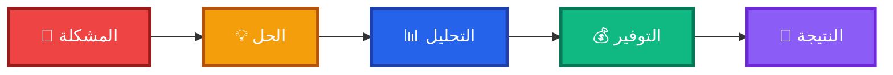

<div align="center">

<!-- ANIMATED HEADER -->


<!-- TYPING ANIMATION -->
<p align="center">
  <a href="https://git.io/typing-svg">
    
  </a>
</p>

<!-- BADGES -->
<p align="center">
  
  
  
  
</p>

<p align="center">
  
  
  
  
</p>

<!-- ANIMATED LINE -->


</div>

---

## ✨ نظرة عامة

<div align="center">

### 🌟 مرحباً بك في **NET FLOW** 🌟


**NET FLOW** هو تطبيق ويب تفاعلي متقدم مصمم خصيصاً لمساعدة المستخدمين في مصر على فهم وتحسين استهلاكهم للإنترنت. يوفر التطبيق أدوات تحليلية قوية وحاسبات ذكية لحساب التكاليف الفعلية لباقات الإنترنت، مع تقديم نصائح عملية لتحسين الأداء وتوفير المال.

</div>

### 🎯 الهدف من المشروع



<div align="right">

**المشكلة:** ارتفاع تكاليف الإنترنت وعدم وضوح الأسعار الفعلية  
**الحل:** أداة حساب ذكية وشفافة تُظهر التكاليف الحقيقية  
**النتيجة:** توفير آلاف الجنيهات سنوياً وتحسين تجربة الاستخدام

</div>

---

## 🎯 المميزات الرئيسية

<div align="center">

### 🔥 **مميزات لا مثيل لها** 🔥

</div>

<table align="center">
<tr>
<td width="33%" align="center">

### 🧮 حاسبة التكاليف الذكية


✅ حساب دقيق للتكلفة الشهرية والسنوية  
✅ تقدير استهلاك البيانات  
✅ تحليل الهدر في الباقات  
✅ حساب التكلفة لكل مستخدم  
✅ دعم جميع أنواع الاستخدام

</td>
<td width="33%" align="center">

### 📊 تحليلات بيانية متقدمة


📈 رسوم بيانية تفاعلية  
📉 مقارنة الباقات المختلفة  
📊 إحصائيات مفصلة  
📋 تقارير شاملة  
🎯 توصيات ذكية

</td>
<td width="33%" align="center">

### 🎨 تصميم عصري فائق


🌓 وضع داكن/فاتح  
🌍 دعم كامل للعربية  
📱 تصميم متجاوب  
✨ تأثيرات حركية  
🎭 واجهة زجاجية

</td>
</tr>
</table>

### 🌟 مميزات إضافية

<div align="right">

```
🔹 نصائح احترافية لتحسين أداء الراوتر
🔹 جدول زمني للبنية التحتية في مصر
🔹 حلول مبتكرة لمشاكل الإنترنت الشائعة
🔹 إحصائيات حية عن سوق الإنترنت المصري
🔹 حفظ تلقائي للإعدادات والتفضيلات
🔹 تجربة مستخدم سلسة واحترافية
```

</div>

---

## 💻 التقنيات المستخدمة

<div align="center">

### 🛠️ **مجموعة تقنيات متقدمة** 🛠️


</div>

<table align="center">
<tr>
<td width="50%">

### 🎨 Frontend Technologies

```javascript
const technologies = {
  markup: "HTML5 Semantic",
  styling: "CSS3 Modern",
  scripting: "Vanilla JavaScript",
  charts: "Chart.js v4.4.0",
  fonts: {
    arabic: "Cairo",
    english: "Poppins"
  },
  features: [
    "Responsive Design",
    "Dark/Light Mode",
    "Local Storage",
    "Intersection Observer",
    "Smooth Animations",
    "Glass Morphism"
  ]
};
```

</td>
<td width="50%">

### ⚡ Core Features

```css
/* تقنيات CSS المتقدمة */
.features {
  backdrop-filter: blur(20px);
  animation: float 20s infinite;
  transition: all 0.3s ease;
  box-shadow: 0 8px 32px rgba(0,0,0,0.16);
  
  /* CSS Variables */
  --primary: #2563eb;
  --secondary: #f97316;
  --success: #10b981;
  
  /* Grid & Flexbox */
  display: grid;
  gap: 2rem;
}
```

</td>
</tr>
</table>

### 📚 المكتبات والإضافات

<div align="center">

| المكتبة | الإصدار | الاستخدام |
|:------:|:-------:|:---------|
| 📊 Chart.js | v4.4.0 | رسم البيانات التفاعلية |
| 🔤 Cairo Font | Latest | الخط العربي |
| 🔤 Poppins Font | Latest | الخط الإنجليزي |
| 🎨 CSS Variables | Native | نظام الألوان الديناميكي |
| 💾 LocalStorage API | Native | حفظ البيانات محلياً |

</div>

---

## 📱 الأقسام الرئيسية

<div align="center">

### 🗺️ **خريطة الموقع التفاعلية** 🗺️

</div>

```
┌─────────────────────────────────────────────────────────────┐
│                     🏠 NET FLOW HOME                        │
└─────────────────────────────────────────────────────────────┘
                              │
        ┌─────────────────────┼─────────────────────┐
        │                     │                     │
        ▼                     ▼                     ▼
┌───────────────┐    ┌────────────────┐    ┌──────────────┐
│  🎯 القسم 1   │    │   🧮 القسم 2   │    │  💡 القسم 3  │
│   Hero        │    │  Calculator    │    │ Router Tips  │
│  Section      │    │    Section     │    │   Section    │
└───────────────┘    └────────────────┘    └──────────────┘
        │                     │                     │
        ▼                     ▼                     ▼
┌───────────────┐    ┌────────────────┐    ┌──────────────┐
│  📊 القسم 4   │    │   📈 القسم 5   │    │  🚀 القسم 6  │
│  Statistics   │    │   Timeline     │    │  Solutions   │
│   Section     │    │    Section     │    │   Section    │
└───────────────┘    └────────────────┘    └──────────────┘
```

### 📑 تفاصيل الأقسام

<div align="right">

#### 🎯 **1. القسم الرئيسي (Hero Section)**
- عنوان رئيسي جذاب بتأثيرات حركية
- نص تعريفي شامل عن الموقع
- أزرار التنقل السريع
- خلفية متحركة بتأثيرات Orbs

#### 🧮 **2. حاسبة التكاليف (Calculator Section)**
- حقول إدخال ذكية مع تحقق فوري
- حسابات تلقائية فورية
- عرض النتائج بتصميم بطاقات
- رسوم بيانية تفاعلية
- دعم سيناريوهات متعددة:
  - 🏠 الاستخدام المنزلي
  - 🏢 الشركات والمكاتب
  - ☕ المقاهي
  - 🎓 المدارس والجامعات

#### 💡 **3. نصائح الراوتر (Router Tips)**
- 10 نصائح احترافية
- تصميم بطاقات أنيقة
- أيقونات توضيحية
- تنظيم في شبكة متجاوبة

#### 📊 **4. الإحصائيات (Statistics)**
- 4 إحصائيات رئيسية
- أرقام متحركة
- تصميم عصري
- ألوان مميزة لكل إحصائية

#### 📈 **5. الجدول الزمني (Timeline)**
- تاريخ تطور الإنترنت في مصر
- تصميم خط زمني تفاعلي
- أحداث مهمة مرتبة زمنياً
- تأثيرات ظهور تدريجي

#### 🚀 **6. الحلول المقترحة (Solutions)**
- حلول مبتكرة للمشاكل الشائعة
- بطاقات حلول تفاعلية
- أيقونات معبرة
- نصائح عملية قابلة للتطبيق

</div>

---

## 🎨 التصميم

<div align="center">

### 🌈 **لوحة الألوان الاحترافية** 🌈


</div>

### 🎨 الألوان الرئيسية

<div align="center">

| اللون | الكود | الاستخدام | معاينة |
|:-----:|:-----:|:----------|:------:|
| **Primary Blue** | `#2563eb` | الأزرار والعناوين |  |
| **Secondary Orange** | `#f97316` | التأكيدات والتنبيهات |  |
| **Success Green** | `#10b981` | الحالات الإيجابية |  |
| **Danger Red** | `#ef4444` | التحذيرات والأخطاء |  |
| **Warning Amber** | `#f59e0b` | التنبيهات المهمة |  |

</div>

### 🌓 الأوضاع (Light/Dark Mode)

<table align="center">
<tr>
<td width="50%" align="center">

#### ☀️ الوضع الفاتح

```css
:root {
  --bg-primary: #ffffff;
  --bg-secondary: #f8fafc;
  --text-primary: #000000;
  --text-secondary: #475569;
  --shadow: rgba(0, 0, 0, 0.08);
}
```

</td>
<td width="50%" align="center">

#### 🌙 الوضع الداكن

```css
[data-theme="dark"] {
  --bg-primary: #0f172a;
  --bg-secondary: #1e293b;
  --text-primary: #f8fafc;
  --text-secondary: #94a3b8;
  --shadow: rgba(0, 0, 0, 0.3);
}
```

</td>
</tr>
</table>

### ✨ التأثيرات البصرية

<div align="right">

```css
/* Glass Morphism Effect */
.glass-card {
  background: rgba(255, 255, 255, 0.1);
  backdrop-filter: blur(20px);
  border: 1px solid rgba(255, 255, 255, 0.2);
  box-shadow: 0 8px 32px rgba(0, 0, 0, 0.16);
}

/* Floating Animation */
@keyframes float {
  0%, 100% { transform: translate(0, 0) scale(1); }
  33% { transform: translate(50px, -50px) scale(1.1); }
  66% { transform: translate(-30px, 30px) scale(0.9); }
}

/* Gradient Orbs */
.gradient-orb {
  filter: blur(80px);
  opacity: 0.3;
  animation: float 20s infinite ease-in-out;
}
```

</div>

### 📐 التخطيط المتجاوب

<div align="center">

| الجهاز | العرض | نقاط الانقطاع |
|:------:|:-----:|:------------:|
| 📱 Mobile | 320px - 767px | `max-width: 767px` |
| 📱 Tablet | 768px - 1023px | `768px - 1023px` |
| 💻 Desktop | 1024px+ | `min-width: 1024px` |

</div>

---

## 📊 لقطات الشاشة

<div align="center">

### 🖼️ **معرض الصور** 🖼️


</div>

<table align="center">
<tr>
<td width="33%" align="center">

### 🏠 الصفحة الرئيسية


*تصميم عصري بخلفية متحركة*

</td>
<td width="33%" align="center">

### 🧮 الحاسبة


*حاسبة ذكية بنتائج فورية*

</td>
<td width="33%" align="center">

### 📊 الرسوم البيانية


*تحليلات بصرية تفاعلية*

</td>
</tr>
<tr>
<td width="33%" align="center">

### 💡 النصائح


*نصائح عملية احترافية*

</td>
<td width="33%" align="center">

### 📈 الجدول الزمني


*تاريخ تطور الإنترنت*

</td>
<td width="33%" align="center">

### 🌙 الوضع الداكن


*تجربة مريحة للعين*

</td>
</tr>
</table>

---

## 🔧 التخصيص

<div align="center">

### ⚙️ **دليل التخصيص الشامل** ⚙️

</div>

### 🎨 تغيير الألوان

<div align="right">

```css
/* افتح ملف index.html وابحث عن :root */
:root {
  /* غيّر الألوان حسب رغبتك */
  --primary-color: #2563eb;     /* اللون الأساسي */
  --secondary-color: #f97316;   /* اللون الثانوي */
  --success-color: #10b981;     /* لون النجاح */
  --danger-color: #ef4444;      /* لون الخطر */
  --warning-color: #f59e0b;     /* لون التحذير */
}
```

</div>

### 📝 تعديل المحتوى

<div align="right">

```html
<!-- في قسم Hero Section -->
<h1 class="hero-title">
  <!-- غيّر العنوان هنا -->
  𝑵𝑬𝑻 𝑭𝑳𝑶𝑾
</h1>

<p class="hero-description">
  <!-- غيّر الوصف هنا -->
  نحو مستقبل رقمي أفضل في مصر
</p>
```

</div>

### 🔢 تعديل الحسابات

<div align="right">

```javascript
// ابحث عن دالة calculateCosts()
function calculateCosts() {
  // يمكنك تعديل الصيغ الحسابية هنا
  const costPerGB = (packagePrice / packageSize).toFixed(2);
  const monthlyRecharges = Math.ceil(dataNeeded / packageSize);
  
  // أضف حساباتك المخصصة
  const customCalculation = /* صيغتك هنا */;
}
```

</div>

### 🌍 إضافة لغات جديدة

<div align="right">

```javascript
// أضف هذا الكود في قسم JavaScript
const translations = {
  ar: { /* النصوص العربية */ },
  en: { /* النصوص الإنجليزية */ },
  fr: { /* أضف الفرنسية */ },
  // أضف المزيد من اللغات
};
```

</div>

---

## 📈 خارطة الطريق

<div align="center">

### 🗺️ **خطة التطوير المستقبلية** 🗺️


</div>

### 🎯 النسخة 1.1.0 (قريباً)

<div align="right">

- [x] ✅ إطلاق النسخة الأولى
- [ ] 🔄 إضافة مقارنة بين الشركات
- [ ] 📱 تطبيق موبايل PWA
- [ ] 🌐 دعم لغات إضافية
- [ ] 💾 حفظ السجلات التاريخية
- [ ] 📧 إرسال التقارير عبر البريد

</div>

### 🚀 النسخة 2.0.0 (Q2 2024)

<div align="right">

- [ ] 🤖 ذكاء اصطناعي لتحليل الاستخدام
- [ ] 📊 لوحة تحكم متقدمة
- [ ] 🔔 تنبيهات ذكية
- [ ] 🗺️ خريطة تغطية الشبكات
- [ ] 💬 منتدى للمستخدمين
- [ ] 🎮 نظام نقاط وجوائز

</div>

### 🌟 النسخة 3.0.0 (المستقبل)

<div align="right">

- [ ] 🔗 API عام للمطورين
- [ ] 🤝 شراكات مع الشركات
- [ ] 📱 تطبيقات iOS & Android أصلية
- [ ] 🌍 توسع إقليمي (دول عربية)
- [ ] 🎯 توصيات شخصية بالذكاء الاصطناعي

</div>

---

## 🤝 المساهمة

<div align="center">

### 💪 **نحب مساهماتك!** 💪


</div>

<div align="right">

### كيفية المساهمة

1. **🍴 Fork المشروع**
   ```bash
   # انقر على زر Fork في أعلى الصفحة
   ```

2. **🌿 إنشاء فرع جديد**
   ```bash
   git checkout -b feature/amazing-feature
   ```

3. **💻 إضافة تعديلاتك**
   ```bash
   git add .
   git commit -m "إضافة ميزة رائعة"
   ```

4. **📤 رفع التغييرات**
   ```bash
   git push origin feature/amazing-feature
   ```

5. **🎉 فتح Pull Request**
   - اذهب لصفحة المشروع
   - انقر على "New Pull Request"
   - صف تغييراتك بوضوح

### 📋 إرشادات المساهمة

- ✅ اتبع أسلوب الكود الحالي
- ✅ اختبر تعديلاتك جيداً
- ✅ أضف تعليقات واضحة
- ✅ حدّث التوثيق إن لزم
- ✅ احترم معايير الكود

### 🐛 الإبلاغ عن الأخطاء

وجدت خطأ؟ افتح Issue جديد وضمّن:
- وصف واضح للمشكلة
- خطوات إعادة إنتاج الخطأ
- لقطات شاشة إن أمكن
- بيئة التشغيل (متصفح، نظام تشغيل)

</div>

---

## 📄 الترخيص

<div align="center">

### 📜 **MIT License** 📜

```
Copyright (c) 2024 NET FLOW

يُسمح بحرية استخدام هذا البرنامج لأي غرض،
بما في ذلك الاستخدام التجاري، دون أي قيود،
بشرط الإبقاء على إشعار حقوق النشر هذا.
```

[](https://opensource.org/licenses/MIT)

</div>

---

## 📞 التواصل

<div align="center">

### 💌 **تواصل معنا** 💌


<br>

<p align="center">
  <a href="mailto:contact@netflow.example.com">
    
  </a>
  <a href="https://twitter.com/netflow">
    
  </a>
  <a href="https://facebook.com/netflow">
    
  </a>
  <a href="https://linkedin.com/company/netflow">
    
  </a>
</p>

### 📬 معلومات الاتصال

| الوسيلة | التفاصيل |
|:------:|:---------|
| 📧 البريد الإلكتروني | contact@netflow.example.com |
| 🌐 الموقع الإلكتروني | www.netflow.example.com |
| 💬 الدعم الفني | support@netflow.example.com |
| 📱 واتساب | +20 123 456 7890 |

</div>

---

## 🙏 شكر وتقدير

<div align="center">

### ❤️ **نشكر كل من ساهم في هذا المشروع** ❤️


<br>

**شكر خاص لـ:**
- 🎨 **مجتمع المطورين العرب** - للدعم والإلهام
- 📚 **Chart.js Team** - لمكتبة الرسوم البيانية الرائعة
- 🔤 **Google Fonts** - للخطوط الجميلة
- 💻 **Stack Overflow** - للحلول والمساعدة
- 🌟 **كل من استخدم وساهم في تحسين المشروع**

</div>

---

<div align="center">

### 🌟 **إذا أعجبك المشروع، لا تنسَ إضافة نجمة** ⭐ **لدعمنا!** 🌟


### صُنع بكل ❤️ في مصر 🇪🇬

<br>

<p align="center">
  
</p>

<br>

<!-- FOOTER WAVE -->


---

**NET FLOW** | نسخة 1.0.0 | 2024 © جميع الحقوق محفوظة

</div>

